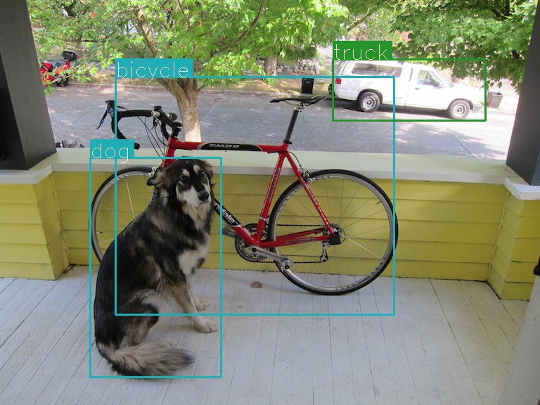
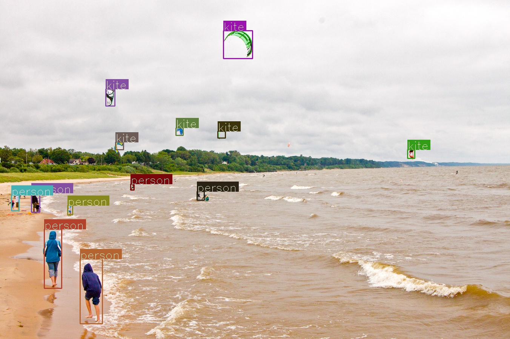

# YOLOv3
Pytorch implementation of real time object detection algorithm YOLOv3
- Assisted by crypto-code [Website](https://github.com/crypto-code/YOLO/tree/master)

To run this detection algorithm, downloading all the files, download pretrained weights into the main folder
[here](https://pjreddie.com/media/files/yolov3.weights)

## Requirements

- Pytorch 0.4
- OpenCV 3.4

## Usage
 
```
usage: detector.py [-h] -i INPUT [-t OBJ_THRESH] [-n NMS_THRESH] [-o OUTDIR]
                   [-v] [-w] [--cuda] [--no-show]

YOLOv3 object detection

optional arguments:
  -h, --help            show this help message and exit
  -i INPUT, --input INPUT
                        input image or directory or video
  -t OBJ_THRESH, --obj-thresh OBJ_THRESH
                        objectness threshold, DEFAULT: 0.5
  -n NMS_THRESH, --nms-thresh NMS_THRESH
                        non max suppression threshold, DEFAULT: 0.4
  -o OUTDIR, --outdir OUTDIR
                        output directory, DEFAULT: detection/
  -v, --video           flag for detecting a video input
  -w, --webcam          flag for detecting from webcam. Specify webcam ID in
                        the input. usually 0 for a single webcam connected
  --cuda                flag for running on GPU
  --no-show             do not show the detected video in real time
```

To tune hyper parameters, change the cfg file.


demo





#### Detecting on a video or a webcam

How to run:
python3 detector.py -v -w -i 0 --cuda


## Reference
To Read More on YOLO
- Paper [YOLOv3: An Incremental Improvement](https://pjreddie.com/media/files/papers/YOLOv3.pdf)
- Paper [Website](https://pjreddie.com/darknet/yolo/)

